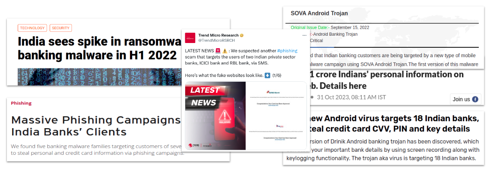
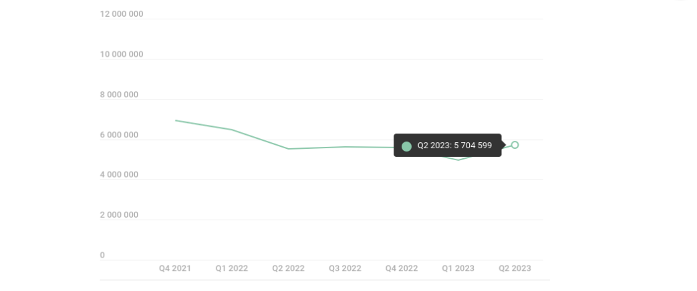
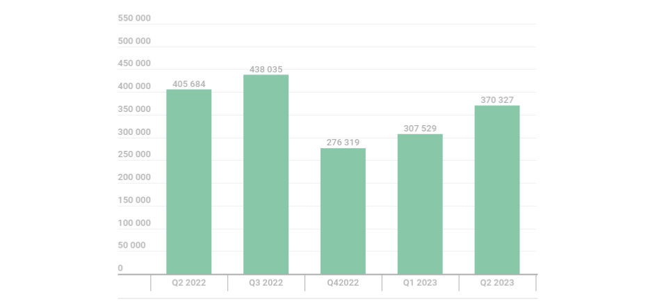

## Introduction
Mobile applications and services are essential to our everyday lives both at home and at work. 

Smartphones have revolutionized the way we communicate, we surf the internet, we do payments, we do gaming and many more.

They have the capability to perform the functionality of  a camera, calculator, barcode reader, credit card scanner, USB thumb drive, eBook reader, audio recorder and many more.

This multi-function capability of the device along with the cost and mobility factor has made mobile devices an important part of personal and business life of people and organizations.

This has led to tremendous increase in the usage of mobile devices in the country.

Now a days, mobile devices have become an important part of personal and business life of people and organizations.

### Statistics of Mobile Usage in India 🇮🇳
India’s smartphone market is projected to grow rapidly until 2025. The growth is driven by availability of cheap mobile data. 

### Statistics of Internet Usage in India 🇮🇳

### Statistics of Mobile Payments in India 🇮🇳
India is home to the world’s fastest growing proximity payment market.

The India Mobile Payments Market size is expected to grow from USD 0.64 trillion in 2023 to USD 2.06 trillion by 2028, at a CAGR of 26.52% during the forecast period (2023-2028).

### App Stats and Trends

As of 21 December 2023, there are 38,22,760 apps on Google Play and 17,96,419 apps on the Apple App Store.

The chart ranks the top categories on Google Play based on the number of apps that compose them.

### Current State of Mobile Security
This tremendous increase in the usage of mobile devices has led to huge amounts of personal and business related data being stored and accessed on the mobile devices.

**This same reason has become the motivation for hackers and attackers to target these devices which have become mini hubs of rich data.**

Android is by large the most widely adopted mobile platform in the world powering over 4.78 billion devices across the globe.

- Main reason for the popularity of Android is its openness & strong eco-system.
    - OEMs
    - Developers
    - Freelancers
    -Users

- Bulk of the mobile phones in India are running a very ==old version of Android==.

- Mobile ==hardware is not manufactured== in the country nor is the software that runs on it.

- Even the ==anti-malware== solutions being used in the country are ==neither designed nor developed== in the country.

- A report from Qualcomm says wallets and mobile banking applications in India are ==not using hardware level security== which can make online transactions more secure.

- There are numerous ==fake banking applications and wallets== detected in the Google playstore targeting victims in India which mimic the names or graphic design specifications of existing apps. 

- ==Insecure mobile browsers== are posing a serious threat to the security and privacy of mobile users in the country.

- Anti-Virus companies such as Quick-Heal, Kaspersky etc are extracting lot of analytical information from the users.

- There is a possibility of **increased threat landscape** in the country with the introduction of 5G.

**There has been a rise in detected malware for Android platforms by more than 400% over the past 12 months. This is alarming and further raises security concerns for Android app users.**

### Why security is important?

### What is Mobile Security?
- Mobile security is all about securing your smartphone from digital risks and dangers.

- With phones storing loads of personal data, mobile security becomes crucial to prevent attempts by cyber intruders.

## Mobile Threats Landscape

### What are Mobile Threats?

Mobile security threats are attacks that are intended to **compromise** or **steal data** from mobile devices like smartphones and tablets. 

These threats often take the form of **malware** or **spyware**, giving bad actors **unauthorized access** to a device; in many cases, users aren't even aware that an attack has occurred.

### Mobile Threat Statistics
According to Kaspersky Security Network, in Q2 2023:

- A total of **5,704,599** mobile malware, adware, and riskware attacks were detected.
- The most common threat to mobile devices was **potentially unwanted software** (RiskTool): 30.8% of all threats detected.
- A total of 370,327 malicious installation packages were detected, of which:
    - 59,167 packages were related to **mobile banking trojans**,
    - 1318 packages were mobile **ransomware trojans**.

The number of malware, adware, or unwanted software attacks on mobile devices began to climb again in Q2 2023.

In Q4 2022, we observed a noticeable decline in the number of malware installers due to decreased activity by Trojan.

Q1 2023 saw a slight increase in the number of new malware samples, which continued into Q2.

