## Introduction
Mobile applications and services are essential to our everyday lives both at home and at work. 

Smartphones have revolutionized the way we communicate, we surf the internet, we do payments, we do gaming and many more.

They have the capability to perform the functionality of  a camera, calculator, barcode reader, credit card scanner, USB thumb drive, eBook reader, audio recorder and many more.

This multi-function capability of the device along with the cost and mobility factor has made mobile devices an important part of personal and business life of people and organizations.

This has led to tremendous increase in the usage of mobile devices in the country.

Now a days, mobile devices have become an important part of personal and business life of people and organizations.

### Statistics of Mobile Usage in India 🇮🇳
India’s smartphone market is projected to grow rapidly until 2025. The growth is driven by availability of cheap mobile data. 

### Statistics of Internet Usage in India 🇮🇳

### Statistics of Mobile Payments in India 🇮🇳
India is home to the world’s fastest growing proximity payment market.

The India Mobile Payments Market size is expected to grow from USD 0.64 trillion in 2023 to USD 2.06 trillion by 2028, at a CAGR of 26.52% during the forecast period (2023-2028).

### App Stats and Trends

As of 21 December 2023, there are 38,22,760 apps on Google Play and 17,96,419 apps on the Apple App Store.

The chart ranks the top categories on Google Play based on the number of apps that compose them.

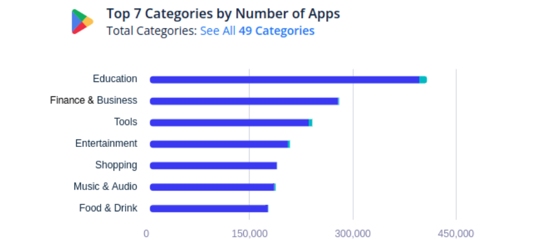

### Current State of Mobile Security
This tremendous increase in the usage of mobile devices has led to huge amounts of personal and business related data being stored and accessed on the mobile devices.

**This same reason has become the motivation for hackers and attackers to target these devices which have become mini hubs of rich data.**

Android is by large the most widely adopted mobile platform in the world powering over 4.78 billion devices across the globe.

- Main reason for the popularity of Android is its openness & strong eco-system.
    - OEMs
    - Developers
    - Freelancers
    -Users

- Bulk of the mobile phones in India are running a very ==old version of Android==.

- Mobile ==hardware is not manufactured== in the country nor is the software that runs on it.

- Even the ==anti-malware== solutions being used in the country are ==neither designed nor developed== in the country.

- A report from Qualcomm says wallets and mobile banking applications in India are ==not using hardware level security== which can make online transactions more secure.

- There are numerous ==fake banking applications and wallets== detected in the Google playstore targeting victims in India which mimic the names or graphic design specifications of existing apps. 

- ==Insecure mobile browsers== are posing a serious threat to the security and privacy of mobile users in the country.

- Anti-Virus companies such as Quick-Heal, Kaspersky etc are extracting lot of analytical information from the users.

- There is a possibility of **increased threat landscape** in the country with the introduction of 5G.

**There has been a rise in detected malware for Android platforms by more than 400% over the past 12 months. This is alarming and further raises security concerns for Android app users.**

### Why security is important?

### What is Mobile Security?

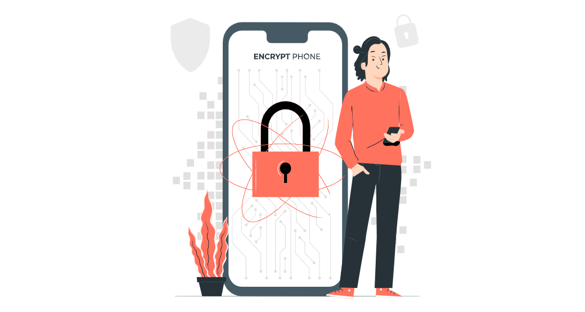

- Mobile security is all about securing your smartphone from digital risks and dangers.

- With phones storing loads of personal data, mobile security becomes crucial to prevent attempts by cyber intruders.

## Mobile Threats Landscape

### What are Mobile Threats?

Mobile security threats are attacks that are intended to **compromise** or **steal data** from mobile devices like smartphones and tablets. 

These threats often take the form of **malware** or **spyware**, giving bad actors **unauthorized access** to a device; in many cases, users aren't even aware that an attack has occurred.

### Mobile Threat Statistics
According to Kaspersky Security Network, in Q2 2023:

- A total of **5,704,599** mobile malware, adware, and riskware attacks were detected.
- The most common threat to mobile devices was **potentially unwanted software** (RiskTool): 30.8% of all threats detected.
- A total of 370,327 malicious installation packages were detected, of which:
    - 59,167 packages were related to **mobile banking trojans**,
    - 1318 packages were mobile **ransomware trojans**.

The number of malware, adware, or unwanted software attacks on mobile devices began to climb again in Q2 2023.

In Q4 2022, we observed a noticeable decline in the number of malware installers due to decreased activity by Trojan.

Q1 2023 saw a slight increase in the number of new malware samples, which continued into Q2.

### Major Mobile Threats
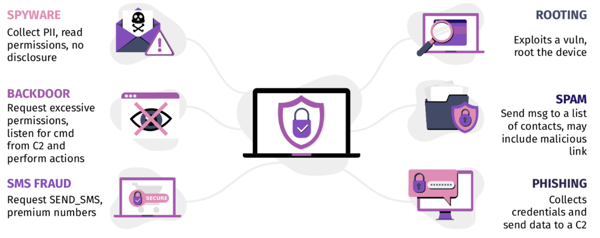

#### Adware

- Adware is unwanted software designed to throw advertisements up on your screen.

- Adware, in general, collects personal information from the device such as phone number, email address, application accounts, International Mobile Equipment Identity (IMEI) number of the device, device ID, and status. 

#### Spyware

- Spyware is malware that secretly observes your activities without permission and reports it to the software’s author.

- It can track your logins and passwords, as well as track your phone itself and extract your most sensitive information, including your GPS location.

#### Trojan

- A Trojan works by presenting itself as something useful like an app or attachment in order to trick you into downloading it. 

- Trojan attacks can hide anything from malware that allows the attacker unauthorized access to spyware that steals financial information.

#### Ransomware

- Ransomware is a form of malware that locks you out of your device and encrypts your files, then forces you to pay to get your files back using hard-to-trace cryptocurrencies. 

- Ransomware has been called the cyber criminal’s weapon of choice because it’s easy to obtain on online criminal marketplaces, difficult to defend against, and even more difficult to remove. Most victims have no choice but to pay up.

#### Fake/Hidden Apps

- Hidden administrator apps are a type of malware that target Android devices. 

- These threats are characterized by stealth implementation and elevated user privileges, so you don't easily see them, and they can do more than a regular app can.

- Fake mobile applications are applications that mimic the look and/or functionality of legitimate applications to trick unsuspecting users to install them.

- They are designed to resemble legitimate apps but instead carry out malicious activities. These activities include monitoring your activity, installing malware, showing annoying ads, or stealing your personal information.

- Hidden administrator apps are a type of malware that target Android devices. These threats are characterized by stealth implementation and elevated user privileges, so you don't easily see them, and they can do more than a regular app can.

### Circulation of Threats

### Signs Your Phone Might Be Tapped
How to tell if your phone is tapped, tracked, tapped, or monitored by spy software?

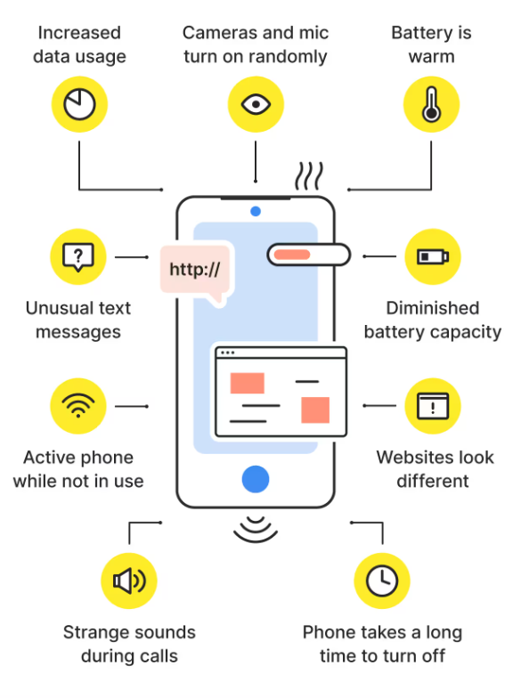

### Reporting Fraud or Attacks
What to Do When Trouble Strikes
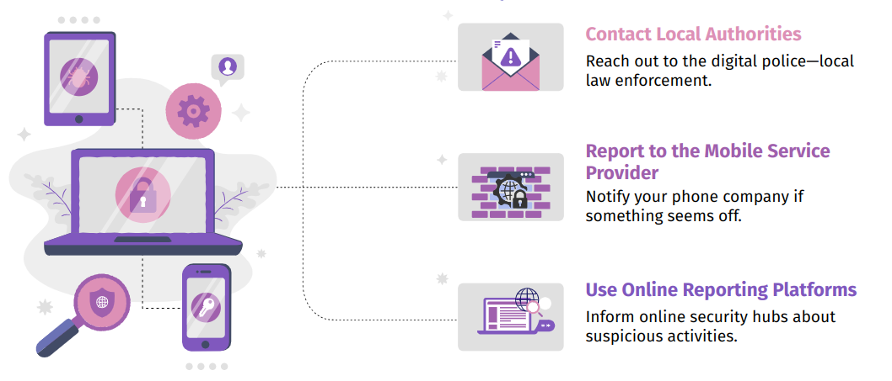

#### National Cyber Crime Reporting Portal (NCRP)
GoI initiative to facilitate victims to report cyber crime complaints online.

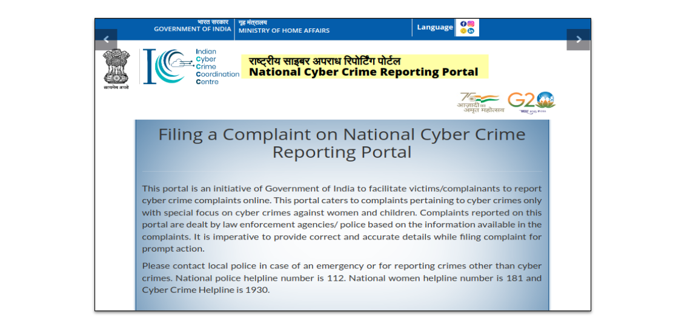

!!! tip " "
    
    https://cybercrime.gov.in/

#### Citizen Financial Cyber Fraud Reporting & Management System (CFCFRMS)
To deal with the complex subject of financial frauds.

!!! tip " "
    
    Helpline Number: ==1930==

#### Central Equipment Identity Register (CEIR)

Online portal for tracing stolen or lost mobile phones.

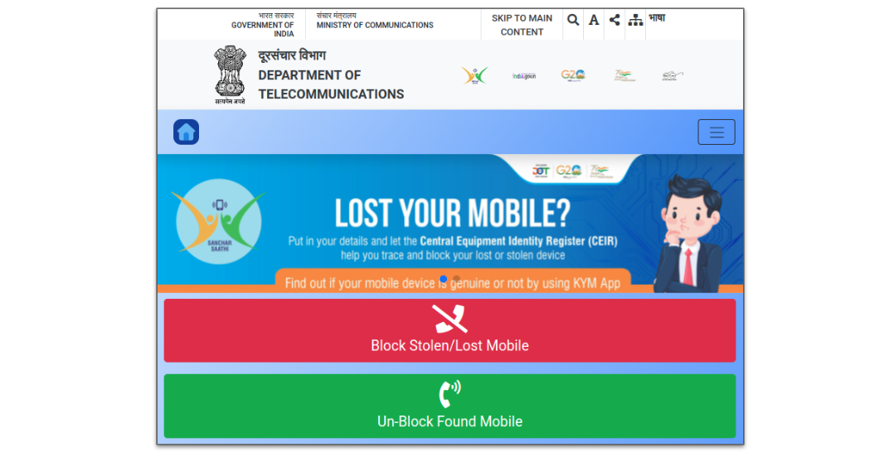

!!! tip " "
    
    https://www.ceir.gov.in/

### Counter Measures to Mobile Threats

## Emerging Jobs in Mobile Security Domain

- Mobile Security Market size was valued at USD 8.5 billion in 2022. 

- The Mobile Security market industry is projected to grow from USD 9.367 Billion in 2023 to USD 20.372 billion by 2032.

- India is the fastest growing mobile security market in the world.

### Job Landscape in India 🇮🇳 

The India Cybersecurity Market size is estimated at USD 3.97 billion in 2023, and is expected to reach USD 9.21 billion by 2028, growing at a CAGR of 18.33% during the forecast period (2023-2028). 

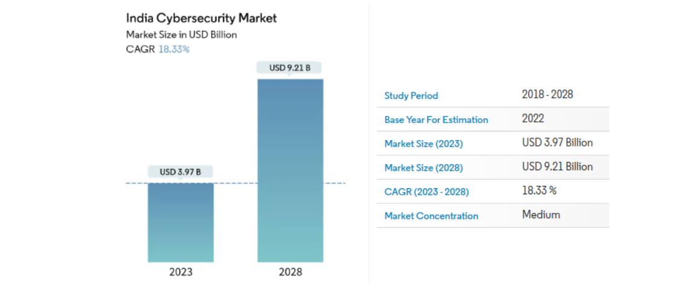

Here is a quick summary of a few aspects of the cybersecurity industry in India, making it a promising career choice.

- The National Association of Software and Services Companies (NASSCOM) reported that India lacks skilled cyber security specialists regardless of having the largest global IT talent pool.

- According to news, there were over 40, 000 Cyber Security jobs available in India as of mid 2023.

- And, according to PayScale, an Information Security Manager in India can earn an average salary of ₹19,32,475 per annum.

#### Percentage of Cybersecurity Professionals by Experience
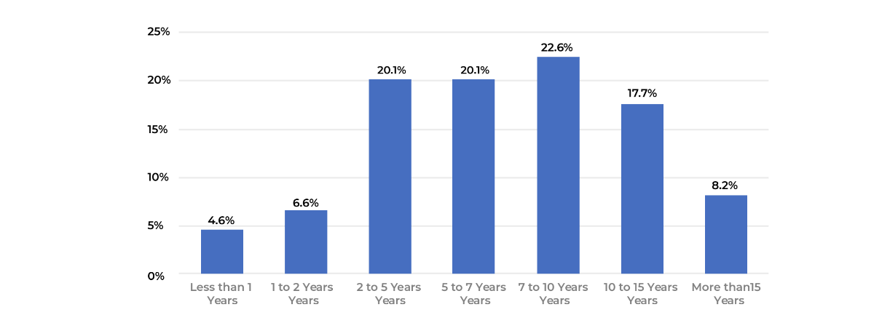

#### Percentage of Cybersecurity Personnel across Salary Brackets

#### City-wise job Comparison

#### Sector-wise Job Break-up

(Excluding IT Software Services, Consulting, and Network / Security Firms)

#### Percentage of Jobs - Organization Type
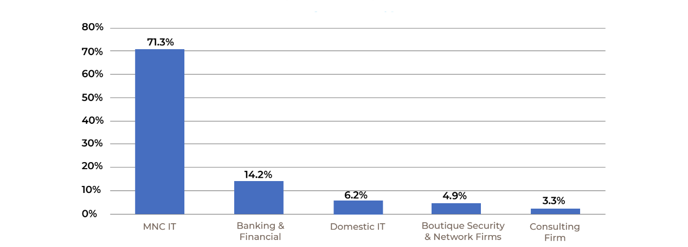

### Cyber Security Career Options

Following Cyber Security jobs in India witnessed an increase in demand due to the shortage of skilled Cyber Security specialists:

<!-- 
#### Information Security Specialist

| Attribute         | Description  | 
| :---------        | :----------  |
| Title             | text         |
| Description       | text         |
| Average Salary    | text         |
| Related Job Roles | text         |
| Eligibility       | text         |

#### Information Security Analyst

| Attribute         | Description  | 
| :---------        | :----------  |
| Title             | text         |
| Description       | text         |
| Average Salary    | text         |
| Related Job Roles | text         |
| Eligibility       | text         |

#### Security Engineer

| Attribute         | Description  | 
| :---------        | :----------  |
| Title             | text         |
| Description       | text         |
| Average Salary    | text         |
| Related Job Roles | text         |
| Eligibility       | text         |

#### Information Security Manager 

| Attribute         | Description  | 
| :---------        | :----------  |
| Title             | text         |
| Description       | text         |
| Average Salary    | text         |
| Related Job Roles | text         |
| Eligibility       | text         |

#### Malware Analyst 

| Attribute         | Description  | 
| :---------        | :----------  |
| Title             | text         |
| Description       | text         |
| Average Salary    | text         |
| Related Job Roles | text         |
| Eligibility       | text         |

#### Penetration Tester

| Attribute         | Description  | 
| :---------        | :----------  |
| Title             | text         |
| Description       | text         |
| Average Salary    | text         |
| Related Job Roles | text         |
| Eligibility       | text         |

#### Chief Information Security Officer (CISO)

| Attribute         | Description  | 
| :---------        | :----------  |
| Title             | text         |
| Description       | text         |
| Average Salary    | text         |
| Related Job Roles | text         |
| Eligibility       | text         |

#### Cryptography Engineer

| Attribute         | Description  | 
| :---------        | :----------  |
| Title             | text         |
| Description       | text         |
| Average Salary    | text         |
| Related Job Roles | text         |
| Eligibility       | text         |

-->

### How to Start a Cyber Security Career?

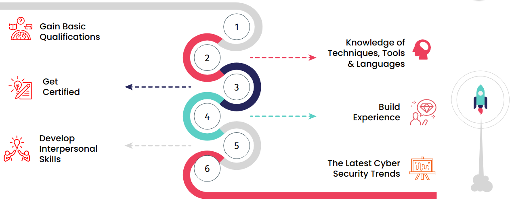

#### Academic Background
Degrees in cybersecurity, computer science & engineering, information technology, or related fields.

#### Certifications

- Certified Information System Security Professional (CISSP)
- CompTIA Security+ 
- Certified Ethical Hacker (CEH v11)
- Certified Cloud Security Professional (CCSP)
- Information System Security Architecture Professional (ISC)
- Certified Information System Auditor (CISA)
- Certified Information Systems Security Professional (CISM)
- Information Systems Security Management Professionals (CISSP-ISSMP)
- Certified Mobile and Web App Penetration Tester (CMWAPT)	

#### Skill Development

- Proficiency in programming languages.
- Familiarity with operating systems.
- Training on security frameworks and tools.
- Importance of staying updated with the latest industry trends.

## Conclusion

Empower Your Digital Life: Taking Charge of Security

