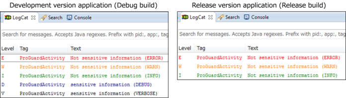

## Introduction

With the Android platform fast becoming a target of malicious hackers, applications security is no longer an add-on, but a crucial part of the developer’s job.

This post provides secure coding practices that a developer need to follow in order to design and implement robust, rugged, and secure apps for Android device.


## 1. Verify for Security Early and Often

### Securing Application Components

- Application Components are the essential building blocks of an Android Application.

- Each component is an entry point through which the system or a user can enter your application.

- Four major Android Application Components are: 
    - Activities
    - Services
    - Content Providers
    - Broadcast Receivers

- One of the common mistakes while developing applications is unintentionally leaving application components exposed.

- Application components can be secured both by making proper use of the ==**AndroidManifest.xml**== file and by forcing permission checks at code level.

- These two factors of application security make the permissions framework quite flexible and allow you to limit the number of applications accessing your components in quite a granular way.

- The ==**android:exported**== attribute defines whether a component can be invoked by other applications.

- If any of your application components do not need to be invoked by other applications or need to be explicitly shielded from interaction with the components on the rest of the Android system (other than components internal to your application)

- You should add the following attribute to the application component's XML element:

``` java title="AndroidManifest.xml" linenums="1" hl_lines="1"
<[component-name] android:exported="false">
...
</[component-name]>
```

- Here the [component name] would either be an activity, provider, service or a receiver.

### Protecting components with Custom Permissions

- The Android platform defines a set of default permissions which are used to secure system services and application components.

- Largely, these permissions work in the most generic case, but often when sharing bespoke functionality or components between applications it will require a more tailored use of the permissions framework.

- **This is facilitated by defining custom permissions**.

___

**Following snippets demonstrates how you can define your own custom permissions**:

1. Before adding any custom permissions, you need to declare string resources for the permission labels. You can do this by editing the strings.xml file in your application project folder under ==**res/values/strings.xml**==:
``` java title="res/values/strings.xml" linenums="1"
<string name="custom_permission_label">Custom Permission</string>
```

2. Adding normal protection-level custom permissions to your application can be done by adding the following lines to your ==**AndroidManifest.xml**== file:
``` java title="AndroidManifest.xml" linenums="1"
<permission android:name="android.permission.CUSTOM_PERMISSION"
android:protectionLevel="normal"
android:description="my custom permission"
android:label="@string/custom_permission_label">
```

3. Making use of this permission works the same as any other permission; you need to add it to the ==**android:permission**== attribute of an application component.
``` java title="AndroidManifest.xml" linenums="1"
<[component-name] ...
    android:permission="android.permission.CUSTOM_PERMISSION">
</[component-name]>
```
Here the [component name] would either be an activity, provider, service or a receiver.

4. You can also allow other applications to request this permission by adding the ==**\<uses-permission/>**== tag to an application's AndroidManifest.xml file:
``` java title="AndroidManifest.xml" linenums="1"
<uses-permission android:name="android.permission.CUSTOM_PERMISSION"/>
```

**The breakdown of the attributes of ==**\<permission>**== element is as follows**:

- **android:name** - This defines the name of the permissions, which is the string value that will be used to reference this permission.

- **android:protectionLevel** - This defines the protection level of the permission and controls whether users will be prompted to grant the permission. Following are the Protection Levels:
    - **normal** -  This permission is used to define non dangerous permissions, these permissions will not be prompted and may be granted autonomously.
    
    - **dangerous** - This permission is used to define permissions that expose the user to considerable fiscal, reputational, and legal risk.

    - **signature** -  This permission is granted autonomously to applications that are signed with the same key as the application that defines them.
    
    - **signatureOrSystem** - This permission is automatically granted to any application that forms a part of the system image or is signed with the same key as the application that defines them.


## 2. Parameterized Queries

### SQL Injection

- One specific form of a class of vulnerabilities known as command injection.

- In this type of vulnerability, input from an outside source is used directly as part of a command, in this case a SQL expression that is passed to a database interpreter.

**For Example:**

- consider a case where the user supplies a username and password to an application, which must then verify that the combination is valid to allow access.
``` java linenums="1"
String loginQuery = "SELECT * FROM useraccounts WHERE userID = '" + request.getParameter("userID") + "' AND password = '" + request.getParameter("password") + "'";
```

- However, if whoever is submitting the information were to submit these values:
``` java linenums="1" 
userID = ' or 1=1 --
password = doesNotMatter
```

- The resulting query that would be supplied to the SQL database interpreter would be:
``` java linenums="1" 
SELECT * FROM useraccounts WHERE userID='' or 1=1 -- AND password='doesNotMatter'
```
This SQL statement would then evaluate and return all of the data from the user accounts table, as the WHERE condition would always be true (due to the OR 1=1 condition) and the password checking clause would be commented out.

___

**This unintended behavior is made possible because of two primary problems.**

- **First**, our app did not properly validate the input that was received before using that input to form the SQL statement to be submitted to the database interpreter.

- **Second**, the problem is enabled because when query strings are constructed in such a manner, the database system cannot tell the difference between code and data; the initial apostrophe ==(')== submitted in the *userID* is actually data, but is being interpreted as code because the database cannot tell that it should be interpreted as a literal data value.

### Preventing Command Injection

- Looking at an example similar to the earlier one.

- Let's consider looking up a user’s last name in a database. The unsafe way to form this statement looks something like this:
``` java title="Non-Compliant Code" linenums="1" 
SQLiteDatabase db = dbHelper.getWriteableDatabase();
String userQuery = "SELECT lastName FROM useraccounts WHERE userID = " + request.getParameter("userID");
String userLastName = prepStatement.simpleQueryForString();
```

- Here is the proper way to perform such a query against the database, where the command is separated from the data:
``` java title="Compliant Code" linenums="1" 
SQLiteDatabase db = dbHelper.getWriteableDatabase();
String userQuery = "SELECT lastName FROM useraccounts WHERE userID = ?";
SQLiteStatement prepStatement = db.compileStatement (userQuery);
prepStatement.bindString(1, request.getParameter("userID")); 
String userLastName = prepStatement.simpleQueryForString();
```

By taking advantage of the **compileStatement** capability, we can effectively separate commands from data in SQL statements, by using the ==**?**== marker. This is known as a parameterized query, as the query string includes placeholders ==(question marks)== to mark the data and the values for those pieces of data are filled in independently (by the bindString() call in our example).


## 3. Encode Data

- Encoding your data is a solution you should consider if you work with slightly less sensitive data or are looking for a way to organize your data.

- Most encoding methods rely on algorithms to compress the data and reduce its complexity.

- The same algorithm used to encode the data is needed to access the data in a readable format.

- Encoding keeps your data safe since the data is not readable unless you have access to the algorithms that were used to encode it.

- This is a good way to protect your data from theft since any stolen data would not be usable.

- Encoding is an ideal solution if you need to have third parties access your data but do not want to have everyone be able to access some sensitive data.

- Since encoding removes redundancies from data, the size of your data will be a lot smaller.

- This results in faster input speed when data is processed or saved.
Since encoded data is smaller in size, you should be able to save space on your storage devices.

- Encoded data is easy to organize, even if the original data was mostly unstructured.

- This is how we can encode a normal string to a Base64 encoding scheme.
``` java linenums="1" 
String testValue = "Hello, world!";

byte[] encodeValue = Base64.encode(testValue.getBytes(), Base64.DEFAULT);
byte[] decodeValue = Base64.decode(encodeValue, Base64.DEFAULT);

Log.d("ENCODE_DECODE", "defaultValue = " + testValue);
Log.d("ENCODE_DECODE", "encodeValue = " + new String(encodeValue));
Log.d("ENCODE_DECODE", "decodeValue = " + new String(decodeValue));
```
``` java title="Output" linenums="1" 
defaultValue = Hello, world!
encodeValue = SGVsbG8sIHdvcmxkIQ==
decodeValue = Hello, world!
```

## 4. Validate All Inputs

- Input validation is the key component of application security.

- **One of the primary problems in applications is that developers trust that input**.

- Remember that any piece of data submitted from outside your app can be submitted by, or manipulated by, an attacker.

- You need to verify that the data received by your application is valid and safe to process.

- Validating input data is the easiest and yet most effective secure coding method.

- All data that is inputted into the application either directly or indirectly by an outside source needs to be properly validated.

**For Example**:

- Following is an example of an Activity as used in a program that receives data from Intent:
``` java title="Non-Compliant Code" linenums="1" 
TextView tv = (TextView) findViewById(R.id.textview);
InputStreamReader isr = null;
char [] text = new char[1024];
int read;
try {
    String urlstr = getIntent().getStringExtra("WEBPAGE_URL");
    URL url = new URL(urlstr);
    isr = new InputStreamReader(url.openConnection().getInputStream());
    while((read=isr.read(text)) != -1) {
        tv.append(new String(text, 0, read));
    }
} catch (MalformedURLException e) {...}
```

- The example is a simple sample where HTML is acquired from a remote web page in a designated URL and the code is displayed in TextView.

- However, this is not sufficient.

- Furthermore, when a ==**“file://…”**== formatted URL is designated by urlstr, the file of the internal file system is opened and is displayed in TextView rather than the remote web page.

- **The below example shows a revision to fix the security bugs:**
``` java title="Compliant Code" linenums="1" hl_lines="8-11"
TextView tv = (TextView) findViewById(R.id.textview);
InputStreamReader isr = null;
char [] text = new char[1024];
int read;
try {
    String urlstr = getIntent().getStringExtra("WEBPAGE_URL");
    URL url = new URL(urlstr);
    String prot = url.getProtocol();
    if(!"http".equals(prot) && !"https".equals(prot)) {
        throw new MalformedURLException("invalid protocol");
    }
    isr = new InputStreamReader(url.openConnection().getInputStream());
    while((read=isr.read(text)) != -1) {
        tv.append(new String(text, 0, read));
    }
} catch (MalformedURLException e) {...}
```

Validating the safety of input data is called **“Input Validation”** and it is a fundamental secure coding method.

## 5. Implement Identity and Authentication Controls

- Providing a secure login mechanism for your users is harder than on the Web.

- The trend on mobile devices is to make things as easy as possible for the user.

- But if you make it too easy to login into your app, you run the risk of unauthorized users gaining access to sensitive data by going around this authentication.

- The following tokens are common on Android devices as a part of login process:
    - Username and Password
    - Device information, such as DeviceID and AndroidID
    - Network information, such as IP address

- The classic login of username and password is still the most common authentication on an Android phone.

- Let’s look at some best practices for user authentication. 

- The best practices are as follows:
    - No password caching
    - Minimum password length
    - Multi-factor authentication
    - Server-side as well as client-side authentication

- Do not save or cache username, and especially password, information on the phone, as there is always a risk that it will be found and decrypted. 

- Even if you’re encrypting the password, if you’re also storing the key in the APK then it’s going to be unencrypted.

- It is better not to store passwords, if you can get away with it, and make the user Log In each time.

- **Try to enforce a minimum password length** - passwords of less than six characters are highly prone to a brute force attack. Financial apps should have stricter policies than other apps.

- **Validate email addresses** - this can be done either using regular expressions or via an email link during setup or, better still, using both approaches.

- If you do update your password standards, notify your existing customers when they login again to update their passwords.

- It’s becoming very common for applications to use a **Two-Factor Authentication** where a randomly generated PIN number is sent via SMS message to user’s phone before he can log in to the application. 

- We can also use the info like DeviceID, IP Address, and Location information to add extra layers of information.

- **Access control** doesn’t end at the client; it needs to be enforced at the server, too. 

- Some back-end servers mistakenly rely on the client app to perform all authentication and assume that the web server doesn’t need to do any authentication.

- The server should also check for valid credentials each time or use a session token once again over SSL.

- It should also check for unusual activity, such as someone performing a bruteforce attack, and notify the user via email of unusual login activity.

- If you are saving any personal, healthcare, or financial information, you should use an **asymmetric** or **public/private** key. 

- This does require a round trip back to the server to decrypt the data, but if the phone is compromised, the user’s data will remain secure.

- Only the private key can decrypt the data, and that should never be stored on the phone.

## 6. Cryptographically Secure Data

- Encryption techniques are frequently used to ensure confidentiality and integrity, and Android is equipped with a variety of cryptographic features to allow applications to realize confidentiality and integrity.

- You may use password-based key encryption for the purpose of protecting a user’s confidential data assets.

- **Key Points to consider while Encrypting and Decrypting with Password-based keys**:
    - Explicitly specify the encryption mode and the padding.
    - Use strong encryption technologies including algorithms, block cipher modes, and padding modes.
    - When generating a key from password, use Salt.
    - When generating a key from password, specify an appropriate hash iteration count.
    - Use a key of length sufficient to guarantee the strength of encryption.

___

Here is the complete listing that will allow the encryption or decryption of data based on a password:
``` java linenums="1"
String password = ... ;
String PBE_ALGORITHM = "PBEWithSHA256And256BitAES-CBC-BC";
String CIPHER_ALGORITHM = "AES/CHC/PKCSSPadding";
int NUM_OF_ITERATIONS = 1000;
int KEY_SIZE = 256;

byte[] salt = new SecureRandom.nextBytes(new byte[8]);
byte[] iv = new SecureRandom.nextBytes(new byte[16]);

String clearText = ... ; // The value to be encrypted
byte[] encryptedText:
byte[] decryptedtext;

try{
    PBEKeySpec pbeKeySpec = new PBEKeySpec(password.toCharArray(), salt, NUM_OF_ITERATIONS, KEY_SIZE);

    SecretKeyFactory keyFactory = SecretKeyFactory.getInstance(PBE_ALGORITHM);
    SecretKey secretKey = keyFactory.generateSecret(pbeKeySpec);
    SecretKeySpec secretKeySpec = new SecretKeySpec(secretKey.getEncoded(), "AES");
    
    IvParameterSpec ivSpec = new IvParameterSpec(iv):

    Cipher encCipher = Cipher.getInstance(CIPHER_ALGORITHM);
    encCipher.init(Cipher.ENCRYPT_MODE, secretKeySpec, ivSpec);

    Cipher decCipher = Cipher.getinstance(CIPHER_ALGORITHM);
    decCipher.init(Cipher.DECRYPT_MODE, secretKeySpec, ivSpec);

    encryptedText = encCipher.doFinal(clearText.getBytes());
    decyptedText = decCipher.doFinal(encryptedText);

    String sameAsClearText = new String(decryptedText);
} catch (Exception e) {
    ...
}
```
___

In the above snippet:

``` java linenums="1"
String PBE_ALGORITHM = "PBEWithSHA256And256BitAES-CBC-BC";
String CIPHER_ALGORITHM = "AES/CHC/PKCSSPadding";
int NUM_OF_ITERATIONS = 1000;
int KEY_SIZE = 256;
```

- This section of code just sets up the algorithms and parameters we are going to use.

- Here we are using SHA-256 as the Hashing algorithm and AES in CBC mode as the Encryption Algorithm.

- We will use 1,000 iterations of the hashing function during the process and will end up with a 256-bit key.

- We will be using AES, still in Cipher Block Chaining mode, and employ PKCS#5 padding. The padding setting specified how to pad the data being encrypted (or decrypted) if it is not in multiples of 128 bits, as AES operates on blocks of 128 bits at a time. 

- These all are standard algorithms and parameters, representing a strong encryption scheme.

___

``` java linenums="1"
byte[] salt = new SecureRandom.nextBytes(new byte[8]);
byte[] iv = new SecureRandom.nextBytes(new byte[16]);
```

- Here, we set up the **Salt** that will be used in the key derivation computation and the **Initialization Vector** (IV) that will be used in encryption and decryption of data.

___

``` java linenums="1"
String clearText = ... ; // The value to be encrypted
byte[] encryptedText:
byte[] decryptedtext;
```

- Here, we just set up the values we will encrypt and decrypt. 

- For the purpose of this example, **clearText** will hold the string we want to encrypt.

- **encryptedText** is a byte array that will hold the encrypted value of the string.
 
- **decryptedText** will hold the decrypted bytes, once we encrypt the string and then decrypt it.

___

``` java linenums="1"
PBEKeySpec pbeKeySpec = new PBEKeySpec(password.toCharArray(), salt, NUM_OF_ITERATIONS, KEY_SIZE);
SecretKeyFactory keyFactory = SecretKeyFactory.getInstance(PBE_ALGORITHM);
SecretKey secretKey = keyFactory.generateSecret(pbeKeySpec);
SecretKeySpec secretKeySpec = new SecretKeySpec(secretKey.getEncoded(), "AES");
```

- Here, we perform key derivation, going from the user-supplied password to a 256-bit AES key.

___

``` java linenums="1"
IvParameterSpec ivSpec = new IvParameterSpec(iv):
```

- We then set up the Initialization Vector (IV) like this.

___

``` java linenums="1"
Cipher encCipher = Cipher.getInstance(CIPHER_ALGORITHM);
encCipher.init(Cipher.ENCRYPT_MODE, secretKeySpec, ivSpec);

Cipher decCipher = Cipher.getinstance(CIPHER_ALGORITHM);
decCipher.init(Cipher.DECRYPT_MODE, secretKeySpec, ivSpec);
```

- This is the main section of our example. We use the derived key and IV, along with our specification of what encryption parameters we want to use, to form a Cipher object.

- We actually create two, one in **ENCRYPT_MODE** and one in **DECRYPT_MODE**.

- Once we have the cipher objects, we can perform encryption and decryption operations.

- For encryption, we pass the string we want to encrypt (convert into a byte array) to the **doFinal()** method of the encrypting Cipher object. 

- The encryption operation is performed and the resulting encrypted bytes are returned to us.
``` java linenums="1"
encryptedText = encCipher.doFinal(clearText.getBytes());
```

- We can also decrypt data using the same approach. In this case, we use the decrypting Cipher object, passing it the encrypted bytes and getting back to plaintext bytes.

- As we started a string, we can reconstruct it, and the **sameAsClearText** string will contain exactly the same value as the **clearText** string.
``` java linenums="1"
decyptedText = decCipher.doFinal(encryptedText);
String sameAsClearText = new String(decryptedText);
```

___


And that’s it. We now have a complete solution for protecting stored data, where we take a user-supplied password, derive a symmetric key from it, and encrypt and decrypt data at will, all in a few short lines of code.

Once we encrypt the data, we can store it in a file, in a database, or wherever. As long as we keep the symmetric key from compromise, an attacker will not be able to recover the data from its encrypted form.


## 7. Implement Logging and Intrusion Detection

### Tamper Detection
Tamper or Intrusion detection is the ability of an application to sense that an active attempt to compromise the application’s integrity or the data associated with the application is in progress; the detection of the threat may enable the application to initiate appropriate defensive actions.

### Responding to Tamper Detection
- The obvious and simple solution would be to check for tampering on startup, and if detected, exit the app optionally with a message to the user explaining why.

- Here look at different checks that may indicate a tampered, compromised, or hostile environment. 

- These are designed to be activated once you are ready for release.

#### Detect if Google Play store was the installer

- Detecting if the installer was the Google Play store is a simple check that the package name of the installer app matches that of the Google Play store. 

- Specifically, it checks if the installer package starts with ==**com.google.android**==.

- It is a useful check if you are distributed solely through the Google store.

``` java linenums="1"
public static boolean checkGooglePlayStore(Context context) {
    String installerPackageName = context.getPackageManager().getInstallerPackageName(context.getPackageName());
    return installerPackageName != null & installerPackageName.startsWith("com.google.android");
}
```

#### Detect if it runs on an Emulator

- The Java Reflection API makes it possible to inspect classes, methods, and fields at runtime; and in this case, allows us to override the access modifiers that would prevent ordinary code from compiling. 

- The emulator check uses reflection to access a hidden system class, android.os.SystemProperties. 

``` java linenums="1"
public static boolean isEmulator() {
        try {
            Class systemPropertyClazz = Class.forName("android.os.SystemProperties");
            boolean kernelQemu = getProperty(systemPropertyClazz,
                    "ro.kernel.qemu").length() > 0;
            boolean hardwareGoldfish = getProperty(systemPropertyClazz,
                    "ro.hardware").equals("goldfish");
            boolean modelSdk = getProperty(systemPropertyClazz,
                    "ro.product.model").equals("sdk");
            if (kernelQemu || hardwareGoldfish || modelSdk) {
                return true;
            }
        } catch (Exception e) {
            // error assumes emulator
        }
        return false;
}
private static String getProperty(Class clazz, String propertyName) throws Exception {
    return (String) clazz.getMethod("get", new Class[] { String.class })
            .invoke(clazz, new Object[] { propertyName });
}
```

!!! warning " "

    Using hidden APIs can be risky as they can change between Android versions.


#### Detect if it runs on a Rooted Device 
- Rooted devices may contain many apps that process sensitive information, such as banking apps, payment apps, social media, and cloud storage. 

- Malicious downloads can expose your device to hackers. 

- For these reasons, the apps installed on a device need to make sure that the device isn't rooted.

``` java linenums="1"
public static boolean checkRoot(){
    for(String pathDir : System.getenv("PATH").split(":")){
        if(new File(pathDir, "su").exists()) {
            return true;
        }
    }
    return false;
}
```

!!! tip " "

    Use [Rootbeer](https://github.com/scottyab/rootbeer). A simple to use root checking Android library.


#### Detect if the app has the “debuggable” flag enabled
(something that should only be enabled during development)

- When debuggable is enabled, it is possible to connect via the Android Debug Bridge and perform detailed dynamic analysis. 

- The debuggable variable is a simple property of the **\<application>** element in the **AndroidManifest.xml** file. 

- It is perhaps one of the easiest and most targeted properties to alter in order to perform dynamic analysis.

``` java linenums="1"
public static boolean isDebuggable(Context context) {
    return (context.getApplicationInfo().flags & ApplicationInfo.FLAG_DEBUGGABLE) != 0;
}
```

#### Application Signature Verification

- Part of the process of an attacker modifying your application's .apk file breaks the digital signature.

- This means that, if they want to install the .apk file on an Android device, it will need to be resigned using a different signing key.

- Fortunately, at runtime, Android apps can query PackageManager to find app signatures.

``` java linenums="1"
// CERTIFICATE'S SHA1 Signature
private static String CERTIFICATE SHA1 = "71920AC9486E087DCBCF5C7F6FEC952135858CC5";

public static boolean validateAppSignature(Context context) {
    try {
        // get the signature form the package manager
        Packageinfo packageInfo = context.getPackageManager().getPackageInfo(context.getPackageName(), PackageManager.GET_SIGNATURES);

        Signature[] appSignatures = packageInfo.signatures;

        //this sample only checks the first certificate
        for (Signature signature : appSignatures) {
            byte[] signatureBytes = signature.toByteArray();
            //calc shal in hex
            String currentSignature = calcSHA1(signatureBytes);
            //compare signatures
            return CERTIFICATE SHA1.equalsIgnoreCase{currentSignature);
        }
    } catch (Exception e) {
    // if error assume failed to validate
    }
    return false;
}

private static String calcSHA1(byte[] signature) throws NoSuchAlgorithmException {
    MessageDigest digest = MessageDigest.getInstance("SHA1");
    digest.update(signature);
    byte[] signatureHash = digest.digest();
    return bytesToHex(signatureHash);
}

public static String bytesToHex(byte[] bytes) {
    final char[] hexArray = { '0', '1', '2', '3', '4', '5', '6',
            '7', '8','9', 'A', 'B', 'C', 'D', 'E', 'F' };
    char[] hexChars = new char[bytes.length * 2];
    int v;
    for (int j = 0; j < bytes.length; j++) {
        v = bytes[j] & 0xFF;
        hexChars[j * 2] = hexArray[v >>> 4];
        hexChars[j * 2 + 1] = hexArray[v & 0x0F];
    }
    return new String(hexChars);
}
```


!!! warning " "

    The hash values should not be hardcoded in real world and instead should be retrieved from a server.

#### Outputting Log to LogCat

- There’s a logging mechanism called **LogCat** in Android, and not only system log information but also application log information outputs to the Logcat.

- Log information in LogCat can be read out from other application in the same device.

- So the application which outputs sensitive information to LogCat, is considered that it has the vulnerability of the information leakage.

- From a security point of view, in release version application, it’s preferable that any log should not be output.

Here we look for some ways to output messages to LogCat in a safe manner even in a release version application.

- **ProGuard** - the method to control the Log output in release version application.
  ProGuard is one of the optimization tools which automatically delete the unnecessary code like unused methods, etc.

Essentially there are ```5``` types of Log output methods:

| Log Type      | Description  | 
| :---------    | :----------  |
| Log.e()       | ERROR        |
| Log.w()       | WARN         |
| Log.i()       | INFO         |
| Log.d()       | DEBUG        |
| Log.v()       | VERBOSE      |

- It’s recommended to use the following methods for outputting operation log information:
    - Log.e()			//ERROR
    - Log.w()			//WARN
    - Log.i()			//INFO	

- And the following for outputting development log information:
    - Log.d()			//DEBUG
    - Log.v()			//VERBOSE


``` java linenums="1"
//Sensitive information must not be output by
// Log.e(D/w()/i()
Log.e(LOG_TAG, "Not sensitive information (ERROR)");
Log.w(LOG_TAG, "Not sensitive information (WARN)");
Log.i(LOG_TAG, "Not sensitive information (INFO)");

//Sensitive information should be output by
// Log.d()/v() in case of need.
Log.d(LOG_TAG, "sensitive information (DEBUG)");
Log.v(LOG_TAG, "sensitive information (VERBOSE)");
```

- If the application is for release, those two methods would be deleted automatically. 

- ProGuard is used to automatically delete code blocks where **Log.d()** and **Log.v()** is called.
``` java title="proguard-project.txt" linenums="1"
-assumenosideeffects class android.util.log {
    public static sxx d(...);
    public static sxx v(...);
}
```
By specifying **Log.d()** and **Log.v()** as parameter of `-assumenosideeffects` option, call for Log.d() and Log.v() are granted as unnecessary code, and those are to be deleted.




## 8. Leverage Security Frameworks and Libraries

#### Securing SharedPreferences data with Encrypted SharedPreferences

Android provides a simple framework for app developers to persistently store key-value pairs of primitive data types.

Thanks to the **AndroidX Security Library** which was recently added.

It is a library that wraps the default Android SharedPreferences to encrypt the key-value pairs for protecting them against attackers.

1. Simply just create or fetch a Master Key from the Android Keystore:
``` java linenums="1"
MasterKey masterKey = new MasterKey.Builder(context, MasterKey.DEFAULT_MASTER_KEY_ALIAS)
                    .setKeyScheme(MasterKey.KeyScheme.AES256_GCM)
                    .build();
```
We’re given a default key generation specification, AES256_GCM, to use for creating the master key and is recommended to use this specification.

2. Now create an instance of **EncryptedSharedPreferences** which is a wrapper around SharedPreferences and handles all of the encryption.
``` java linenums="1"
SharedPreferences sharedPreferences = EncryptedSharedPreferences.create(
                    context,
                    "my_secure_preferences",
                    masterKey,
                    EncryptedSharedPreferences.PrefKeyEncryptionScheme.AES256_SIV,
                    EncryptedSharedPreferences.PrefValueEncryptionScheme.AES256_GCM);
```
Here `"my_secure_preferences"` is the name of the file in which the preferences will be saved.

3. Once we’ve created our **EncryptedSharedPreferences** instance, we can use it just like SharedPreferences to store and read values.
``` java linenums="1"
//Storing a value
sharedPreferences.edit()
    .putString("key", value)
    .apply()

//Reading a value
sharedPreferences.getString("key", "defaultValue");
```

=== "Standard SharedPreferences file"
    ``` java
    <?xml version='1.0' encoding='utf-8' standalone='yes' ?>
    <map>
        <int name="timeout " value="500" />
        <boolean name="is logged in" value="true" />
        <string name="title">secure coding practices</string>
    </map>
    ```

=== "Encrypted SharedPreferences file"
    ``` java
    <?xml version='1.0' encoding='utf-8' standalone='yes' ?>
    <map>
        <string name="MIIEpQIBAAKCAQEAYyb6BkBms39I7imXMOOUW1EDJIsbGNs">
            HhiXTk3JRgAMuKOwosHLLfaVvRUUT3ICK
        </string>

        <string name="TuwbBUOIrAylL9znGBJI87uEi7pWOFwYwX8SZi11KnD2VZ7">
            va617hf5imdM+P3KA3Ik50ZwFj1/Ed2
        </string>

        <string name="81qCOgn73Uo84Rjk73t1fVNYsPshl119ztma7U">
            tEcsr41t50rGWT9/pqlrMC5x503cc
        </string>
    </map>
    ```

#### Encrypting a database with SQLCipher

SQLCipher is one of the simplest ways to enable secure storage in an Android app, and it's compatible for devices running Android 2.1+.

SQLCipher uses **256-bit AES in CBC mode** to encrypt each database page; in addition, each page has its own random initialization vector to further increase security.

SQLCipher is a separate implementation of the SQLite database, and rather than implementing its own encryption, it uses the widely used and tested **OpenSSL libcrypto** library.

1. There are several ways to handle SQLite database, either by working directly with the SQLiteDatabase object or using SQLiteOpenHelper. 
``` java linenums="1"
import android.database.sqlite.*;   // Don't use this
import net.sqlcipher.database.*;    // Use this instead
```
But generally, if you are already using an SQLite database in your app, simply replace the ==import android.database.sqlite.*== statement with **==import net.sqlcipher.database.*==**

2. The simplest way to create an encrypted SQLCipher database is to call **openOrCreateDatabase(…)** with a `password`:
``` java linenums="1"
private static final int DB_VERSION = 1;
private static final String DB_NAME = "my_encrypted_data.db";
private static final String password = "some-password";

public void initDB(Context context, String password) {
    SQLiteDatabase.loadLibs(context);
    SQLiteDatabase database = SQLiteDatabase.openOrCreateDatabase(DB_NAME, password, null);
    database.execSQL( "create table MyTable(a, b)");
}
```

Rest other operations remain exactly same as that of a normal SQLite database.


#### Android KeyStore Provider

In Android 4.3, a new facility was added to allow apps to save private encryption keys in a system keystore called **Android KeyStore** which restricts access only to the app that created them and it was secured using the device pin code.

Specifically, the Android KeyStore is a certificate store, and so only public/private keys can be stored.

1. Create a handle on your app’s KeyStore:
``` java linenums="1"
public static final String ANDROID_KEYSTORE = "AndroidKeyStore";

public void loadKeyStore() {
    try {
        keyStore = KeyStore.getInstance(ANDROID_KEYSTORE);
        keyStore.load(null);
    } catch (Exception e) {
        // TODO: Handle this appropriately in your app
        e.printStackTrace();
    }
}
```

2. Generate and save the app’s key pair:
``` java linenums="1"
public void generateNewKeyPair(String alias, Context context) throws Exception {
    Calendar start = Calendar.getInstance();
    Calendar end = Calendar.getInstance();
    
    end.add(1, Calendar.YEAR);  // expires 1 year from today

    KeyPairGeneratorSpec spec = new KeyPairGeneratorSpec.Builder(context)
                                    .setAlias(alias)
                                    .setSubject(new X500Principal("CN=" + alias))
                                    .setSerialNumber(BigInteger. TEN)
                                    .setStartDate(start.getTime())
                                    .setEndDate(end.getTime())
                                    .build();

    // use the Android keystore
    KeyPairGenerator gen = KeyPairGenerator.getInstance( "RSA", ANDROID_KEYSTORE);
    gen.initialize(spec);

    // generates the keypair
    gen.generateKeyPair();
}
```

1. Retrieve the key with a given alias: 
``` java linenums="1"
public PrivateKey loadPrivateKey(String alias) throws Exception {
    if(!keyStore.isKeyEntry(alias)) {
        Log.e(TAG, "Could not find key alias: " + alias);
        return null;
    }
    
    KeyStore.Entry entry = keyStore.getEntry(KEY_ALIAS, null);

    if (!(entry instanceof KeyStore.PrivateKeyEntry)) {
        Log.e(TAG, "alias: " + alias + " is not a private key.");
        return null;
    }

    return ((KeyStore.PrivateKeyEntry) entry).getPrivateKey();
}
```

#### Generating a Symmetric Encryption Key

A symmetric key describes a key that is used for both encryption and decryption. To create cryptographically secure encryption keys in general, we use securely generated pseudorandom numbers.

AES is the preferred encryption standard to DES, and typically used with key sizes 128 bit and 256 bit.

1. Write the following function to generate a symmetric AES encrpytion key.
``` java linenums="1"
public static SecretKey generateAESKey(int keySize) throws NoSuchAlgorithmException {
    final SecureRandom random = new SecureRandom();
    final KeyGenerator generator = KeyGenerator.getInstance("AES");
    generator.init(keySize, random);
    return generator.generateKey();
}
```

2. Create a random 32-byte initialization vector (IV) that matches the AES key size of 256 bit.
``` java linenums="1"
private static IvParameterSpec iv; 

public static IvParameterSpec getIV() {
    if (iv == null) {
        byte [] ivByteArray = new byte[32];
        //populate the array with random bytes
        ivByteArray = new SecureRandom().nextBytes(ivByteArray);
        iv = new IvParameterSpec(ivByteArray);
    }
    return iv;
}
```

3. Write the following function to encrypt an arbitrary string.
``` java linenums="1"
public static byte[] encrypt(String plainText) throws GeneralSecurityException, IOException {
    final Cipher cipher = Cipher.getInstance("AES/CBC/PKCS5Padding");
    cipher.init(Cipher.ENCRYPT_MODE, getKey(), getIV());
    return cipher.doFinal(plainText.getBytes("UTF-8"));
}

public static SecretKey getKey() throws NoSuchAlgorithmException {
    if (key == null) {
        key = generateAESKey(256);
    } 
    return key;
}
```

4. For completeness, the preceding snippet shows how to decrypt.
``` java linenums="1"
public static String decrypt(String plainText) throws GeneralSecurityException, IOException {
    final Cipher cipher = Cipher.getInstance("AES/CBC/PKCS5Padding");
    cipher.init(Cipher.DECRYPT_MODE, getKey(), getIV());
    return cipher.doFinal(cipherText).toString();
}
```
The only difference is that here we called the **Cipher.init()** method using the `Cipher.DECRYPT_MODE` constant.
 
 

## 9. Monitor Error and Exception Handling

Exceptions occur when an application gets into an abnormal or error state.

**Monitor Error and Exception Handling is about ensuring that the app will handle an exception and transition to a safe state without exposing sensitive information via the UI or the app's logging mechanisms.**

- Plan for standard **Runtime Exceptions** (e.g. *NullPointerException, IndexOutOfBoundsException, ActivityNotFoundException, CancellationException, SQLException*) by creating proper null checks, bound checks, and the like.

- Make sure that all confidential information handled by high-risk applications is always wiped during execution of the finally blocks.
``` java linenums="1"
byte[] secret;
try {
    //use secret
} catch (SPECIFICEXCEPTIONCLASS | SPECIFICEXCEPTIONCLASS2 e) {
    // handle any issues
} finally {
    //clean the secret.
}
```

- Adding a general exception handler for uncaught exceptions is a best practice for resetting the application’s state when a crash is imminent:
``` java linenums="1"
public class MemoryCleanerOnCrash implements Thread.UncaughtExceptionHandler {

    private static final MemoryCleanerOnCrash S_INSTANCE = new MemoryCleanerOnCrash();
    private final List<Thread.UncaughtExceptionHandler> mHandlers = new ArrayList<>();

    //initialize the handler and set it as the default exception handler
    public static void init() {
        S_INSTANCE.mHandlers.add(Thread.getDefaultUncaughtExceptionHandler());
        Thread.setDefaultUncaughtExceptionHandler(S_INSTANCE);
    }

    @Override
    public void uncaughtException(Thread thread, Throwable ex) {

        //handle the cleanup here
        //....
        //and then show a message to the user if possible given the context
        for (Thread.UncaughtExceptionHandler handler : mHandlers) {
            handler.uncaughtException(thread, ex);
        }
    }
}
```

- Now the handler’s initializer must be called in your custom Application class (e.g., the class that extends Application):
``` java linenums="1"
@Override
protected void attachBaseContext(Context base) {
    super.attachBaseContext(base);
    MemoryCleanerOnCrash.init();
}
```


## 10. Handling Intents

Using an untrusted intent to launch a component, for example, by calling **startActivity();** or to return data, for example, by calling **setResult();** is dangerous and can allow malicious  apps to cause the following problems:

- Steal sensitive files or system data (like SMS messages) from your app.
- Launch your app’s private components with poisoned arguments.

It is important that your app does not call **startActivity**, **startService**, **sendBroadcast**, or **setResult** on untrusted intents without validating or sanitizing these intents.

### Intent Redirection

- Some apps contain an Intent Redirection issue which can allow malicious apps to access private app components or files.

- Intent Redirection occurs when an activity can forward intents to arbitrary components allowing them to reach even unintended private and sensitive ones. 

- Usually, the redirecting activity is intended to launch only a single or a predefined set of activities. 

- Limiting the components that can be reached only to those meant by the developer can eliminate the problem.

- Generally you can put an Intent to an Intent with:
``` java linenums="1"
Intent intent = new Intent();
Intent.putExtra(Intent.EXTRA_INTENT, new Intent());
```

- To retrieve the Intent (from within an Activity) from the intent you can do the following:
``` java linenums="1"
Intent intent = getIntent().getParcelableExtra(Intent.EXTRA_INTENT);
```


#### Private vs Public components can make the difference

If the app component does not need to receive intents from other apps then you can make that app component private by setting the `android:exported="false"` in your app’s **AndroidManifest.xml** file

``` java linenums="1"
<[component-name] android:exported="false">
...
</[component-name]>
```


#### Validating the source of the Intent

You can verify that the originating activity can be trusted using methods like **getCallingActivity()**.

``` java linenums="1"
//Check if the originating Activity is from trusted package
if (getCallingActivity().getPackageName().equals("desired_package")) {

    Intent intent = getIntent();

    //extract the nested Intent
    Intent forward = (Intent) intent.getParcelableExtra("extra_intent");

    //redirect the nested Intent
    startActivity(forward);
}
```

#### Make sure that embedded intent is not harmful

You should verify that the redirected intent:

- will not be sent to any of your app’s private components, and
- will not be sent to an external app’s components.

Apps can check which component will be used to handle the intent before redirecting it using methods like **resolveActivity()**.

``` java linenums="1"
Intent intent = getIntent();

//extract the nested Intent
Intent forward = (Intent) intent.getParcelableExtra("extra_intent");

//get component name
ComponentName name = forward.resolveActivity(getPackageManager());

//Check that the package name and class name are as intended
if (name.getPackageName().equals("desired_package") && name.getClassName().equals( "desired_class")) {
    //redirect the nested Intent
    startActivity(forward);
}
```

